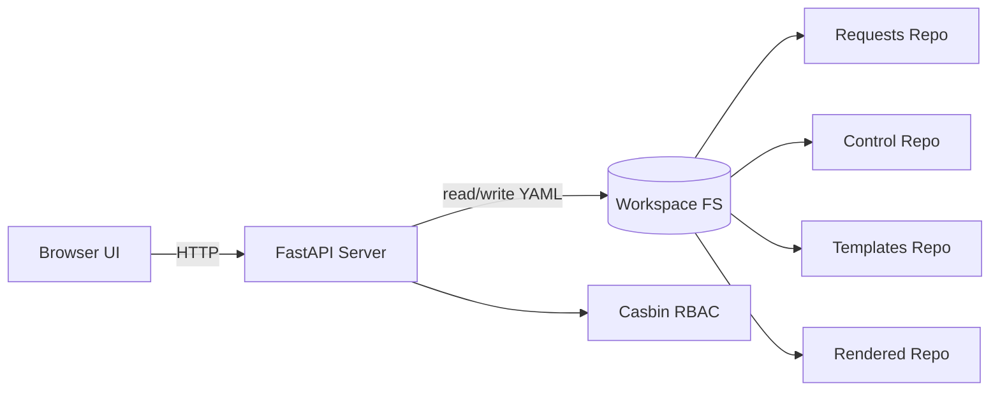
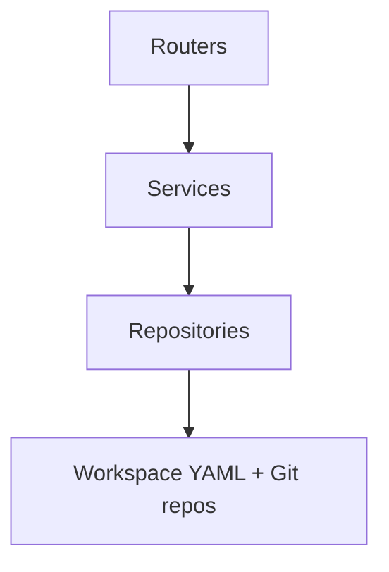
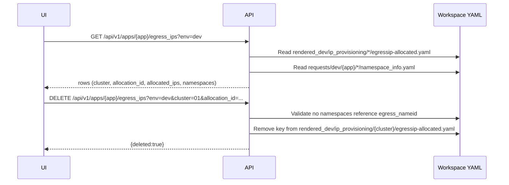

# Architecture

## System overview

This repository contains a FastAPI backend that serves both:

- REST APIs under `/api/v1/...`
- Static frontend assets (React via script tags + Babel standalone)

The system operates against a workspace containing cloned Git repositories (requests/control/templates/rendered). The API modifies YAML in these repos; external GitOps automation is responsible for turning requests into rendered output and cluster state.

## Component diagram

## Backend layering

## Key flows

### Egress IP allocation view + release

## Constraints

- Workspace must be initialized and repos cloned.
- Rendered repo is treated as output/state store for allocations.
- UI is served as static assets; no build pipeline is required.
